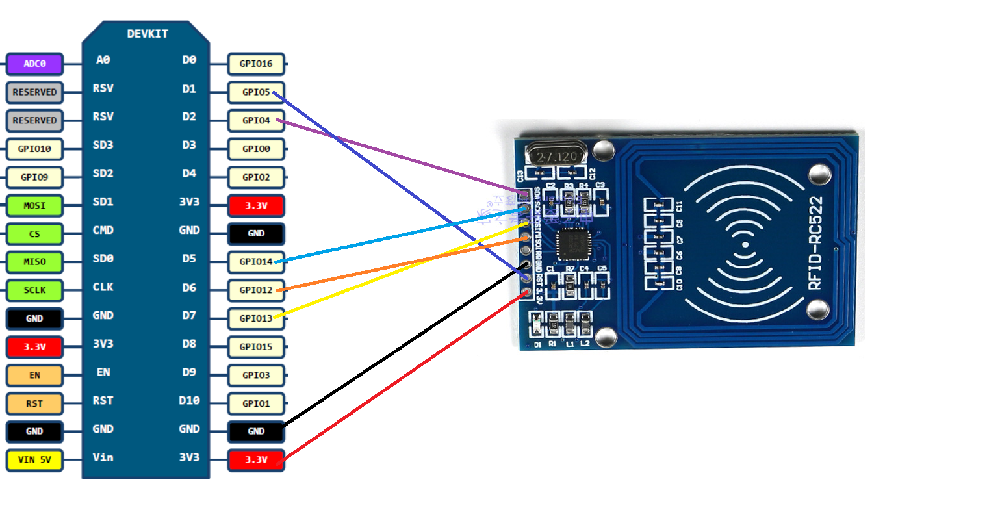

本项目为较久之前的实践项目

同时也是2025年春课程《从代码到实物，造你所想》的期末课程设计

# 基于ESP8266以及RC522模块实现的NFC智能门锁

使用ESP8266实现的NFC刷卡开门装置，支持Blinker远程开门与调试

主要是基于这篇文章完成的
[《esp8266制作NFC电子门锁支持手机控制》
](https://blog.csdn.net/yaolei5/article/details/118583092?spm=1001.2014.3001.5506)

对原作者的程序进行了一些优化，修复了一些原作者没有注意到的bug，实现了断网启动以及自由调试，添加了小爱同学辅助开门。如有侵权请及时指出。如有任何疑问，欢迎在issues中提出。

##  材料：
-   ESP8266
-   RC522模块
-   电源模块
-   舵机
-   杜邦线等必要材料

成本约50元

##    接线
舵机数据线接D3，对应GPIO0

RC522模块接线如下

## 烧录
使用arduinoIDE进行烧录，自行下载依赖包以及支持库。

烧录部分请自行参考网络教程，此处就不赘述了。

烧录前请先完成相关参数的配置（Blinker密钥，WIFI名称以及密码）
##  Blinker配置
下载Blinker手机客户端

[点灯Blinker](https://diandeng.tech/dev)

注册账号，点击右上角添加设备，选择独立设备，选择网络接入，查看密钥，将其添加到代码中。

进入设备管理界面，选择添加组件，注意组件名称和类型一定要和代码中第24行的组件相同。

如果不想自己配置的可以在界面配置中粘贴Blinker_config.json中的数据，这样可以完成自动配置。

具体的操作请阅读[Blinker开发文档](https://diandeng.tech/doc)

